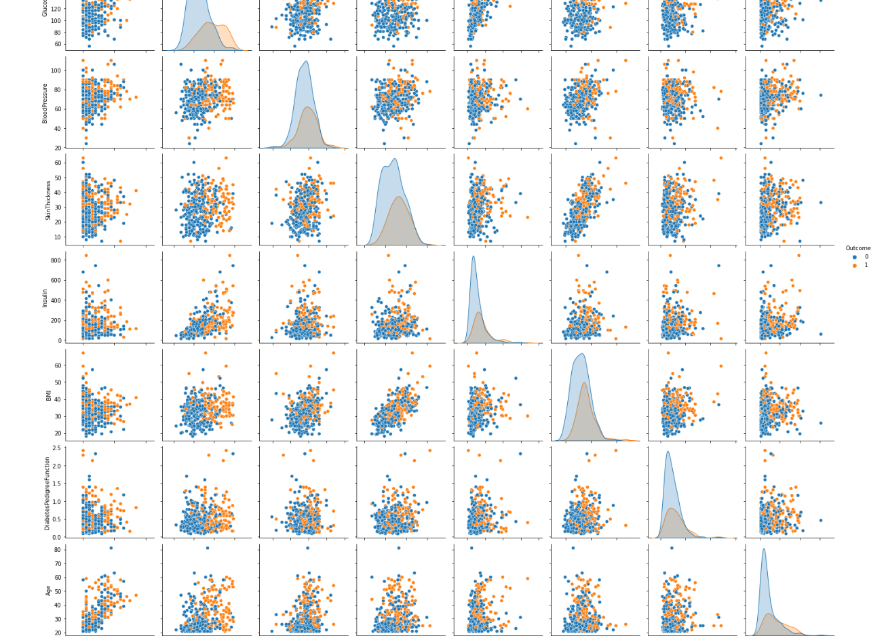
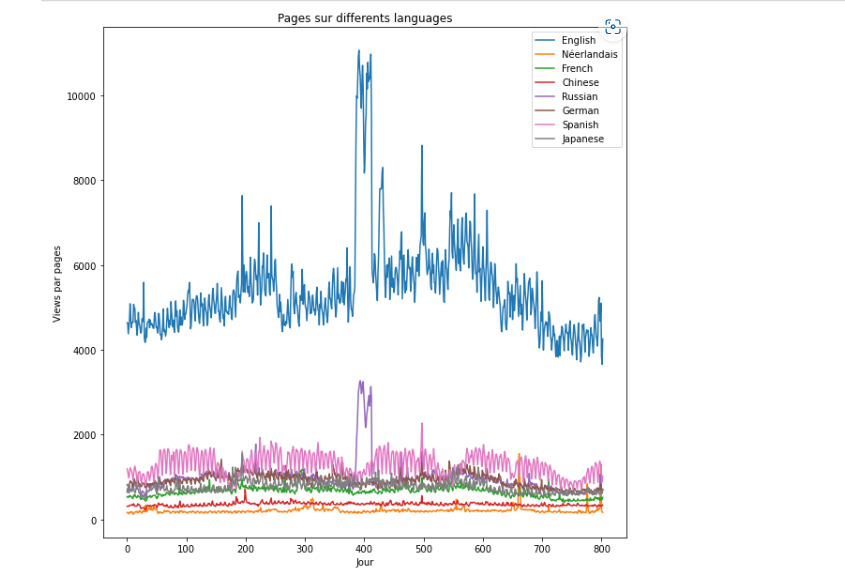
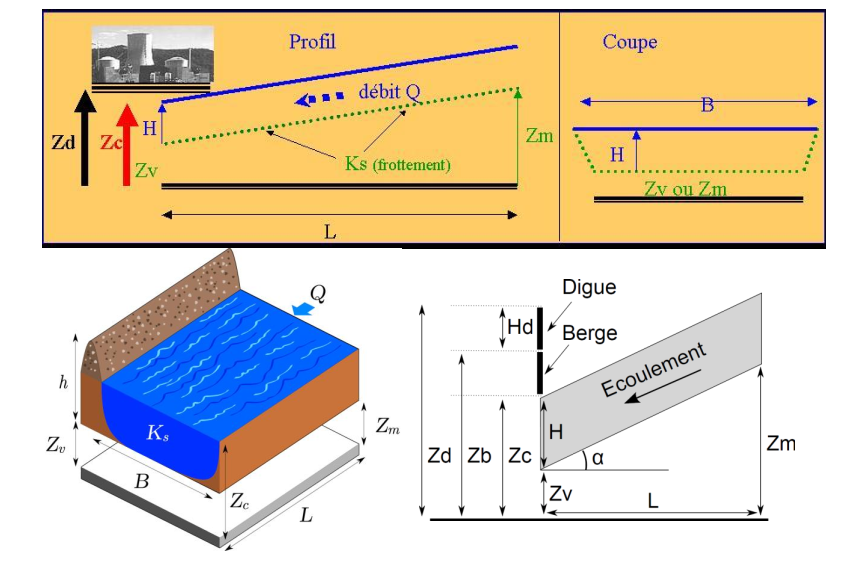
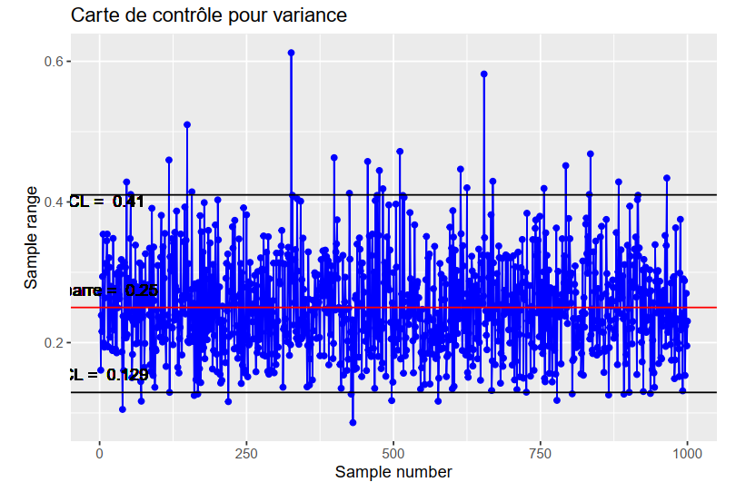
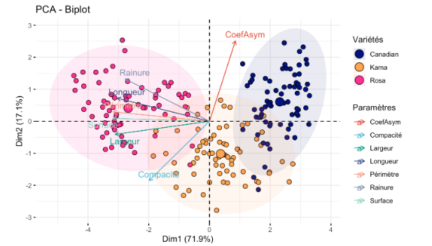
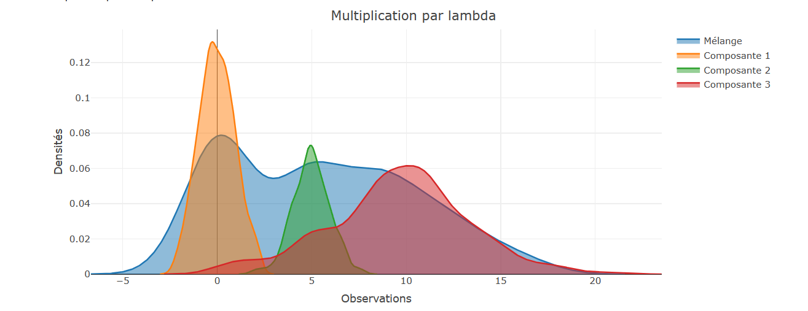
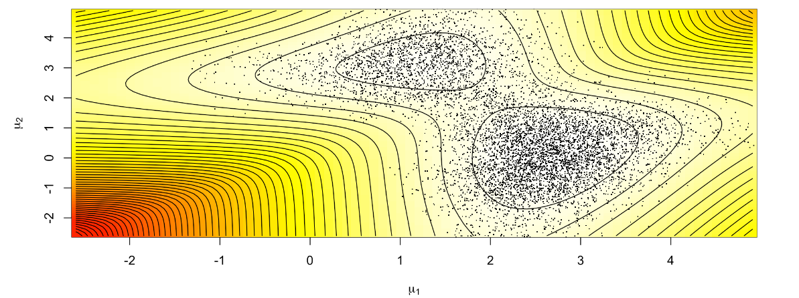

# Portfolio
---
## M2 ISDS - ISUP 

Ma mise en œuvre complète des devoirs et des projets pour le  [***M2 ISDS: Ingénieur Statistique et Data Science***](https://isup.sorbonne universite.fr/formations/filiere-ingenierie-statistique-et-data-science-isds) par Sorbonne University (2022-2023).

---
### Machine Learning: Diabetes classification

To introduce the project, let's start with a small presentation of the framework, the data we have and the variables that compose our database. Then we will do a small visualization of the data and a study of their correlation in order to better understand the links between the variables. Then we will try a clustering (unsupervised learning) of K-means type to see if we can identify groups in our data. And finally, we will start on the training part of the different classifiers (Decision Tree, Logistic Regression, Random Forest, MLP, SVM, QDA, LightGBM, Gradient Boosting and Neural Network) before concluding on the choice that we will make here for our problem.

 

 

---
### Time series: Wikipedia Traffic Forecast

Predicting Wikipedia page traffic is a useful task for understanding how users interact with the platform and for optimizing the performance and availability of Wikipedia servers. In this project, we aim to predict Wikipedia page traffic using three different machine learning models: ARIMA, XGBoost, and Random Forest.

 

 

---
### Industrial statistics

We have a real-life case study in the industry statistics research on floods, water flow, and economic models to determine the appropriate height of the embankment for minimizing potential risks. To solve this problem, we have three research directions: "Determining the height of the embankment based on historical measurement records, determining the height of the embankment based on the hydraulic model, and determining the height of the embankment based on the economic model."

 

 

---
### Parallel Computing: Parallel Implementation of Conway's Game of Life

John Conway came up with the Game of Life in 1970. The game demonstrates the fact that some simple local rules can lead to interesting large-scale life behavior(birth, reproduction and death). The game is played in a 2 dimensional grid N x N, made of cells, that can be either alive, or dead. The game does not have any players, thus it does not require any input by the user. Each cell has at most 8 neighbours, that determine its state in the next generation. The re-formation of the grid from generation to generation is done simultaneously, meaning that each state in the next generation depends exclusively in the state of the cell and its neighbours. Our goal is to implement this game, using Parallel programming.

 

 

---
### Statistical Quality Control

Using statistical methods, adequacy tests, and constructing control charts such as CUSUM and EWMA to detect the moment of rupture and the false alarm rate. The results help processes, such as manufacturing, ensure that the procedures will produce more specification-conforming products, thereby creating less waste.

 

 

---

### Latent structure models

#### Kmeans and Hierarchical Ascending Classification

Objective of this project is to warn against an overly systematic or blind application of PCA in a clustering study, and to explore and compare the behavior of Kmeans and ascending hierarchical clustering.

 

 

---

#### Mixing models, Model-Based Clustering, EM algorithm

Objective of this project is first to explore the behavior of the EM in the context of a simple Gaussian mixture model at J components in dimension 1
  
$$
  M = \{ \sum_{j=1}^J \pi_j \phi(\cdot; \mu_j, \sigma_j^2) : (\pi_1, \ldots, \pi_J) \in \Pi_J, \mu_1, \ldots, \mu_J \in \mathbb{R}, \sigma_1^2, \ldots, \sigma_J^2 \in \mathbb{R}_{+}^{*} \}
$$
  
  
$$
  \text{and } \Pi_J = \{(\pi_1, \ldots, \pi_J) \in [0, 1]^J : \sum_{j=1}^J \pi_j = 1\} \text{ and } \phi(\cdot; \mu, \sigma^2) \text{ the Gaussian density of expectancy } \mu \text{ and variance } \sigma^2
$$
  
It is then to initiate the model-based clustering in higher dimension with the Rmixmod package, which allows to fit mixing models.

 

 

--- 

#### Bayesian methods, Markov Chain Monte Carlo(MCMC)

This project is an introduction to Bayesian methods in the context of Gaussian mixture models models, and in particular to the Gibbs sampler and the Metropolis-Hastings algorithm. We are interested in the following mixture model:

$$
  M = \{ \pi \phi(\cdot; \mu_1, 1) + (1 - \pi) \phi(\cdot; \mu_2, 1) : \mu_1 \in \mathbb{R}, \mu_2 \in \mathbb{R} \},
$$
  
with $\phi$ being the Gaussian density on $\mathbb{R}$ and $\pi \neq \frac{1}{2}$ known.
  
The prior distribution of $(\mu_1, \mu_2)$ is given by: $\mu_1 \sim \mathcal{N}(\delta_1, \frac{1}{\lambda}), \mu_2 \sim \mathcal{N}(\delta_2, \frac{1}{\lambda}), \delta_1, \delta_2 \in \mathbb{R}$ and $\lambda > 0$, with $\mu_1$ and $\mu_2$ independent.

 

 

---
## M1 ISIFAR: Statistical and Computer Engineering for Finance, Insurance, and Risk

Ma mise en œuvre complète des devoirs et des projets pour le [***M1 ISIFAR: Statistical and Computer Engineering for Finance, Insurance, and Risk***](https://master.math.univ-paris-diderot.fr/annee/m1-isifar/)) par Université Paris Cité (2021-2022).

---

### Asset Allocation and Portfolio Optimisation

Given a set of traded assets, a classical problem in finance consists in determining the investment strategy
that achieves the best performance over some time horizon

 

 

---
### SVD Analysis & Life Tables

Collaborating with various tables (such as data.frames, tibbles, data.tables, etc.) utilizing dplyr or other query languages (as exemplified by data.table). Visualizing demographic data supplied by the Human Mortality Database organization (https://www.mortality.org). Employing PCA and other matrix-oriented techniques to investigate multivariate datasets (with lifetables considered as multivariate datasets). Applying the Lee-Carter model for predicting mortality quotients.

 

 

---

© 2023 Ngo Khoa Anh. Powered by Jekyll and the Minimal Theme.

