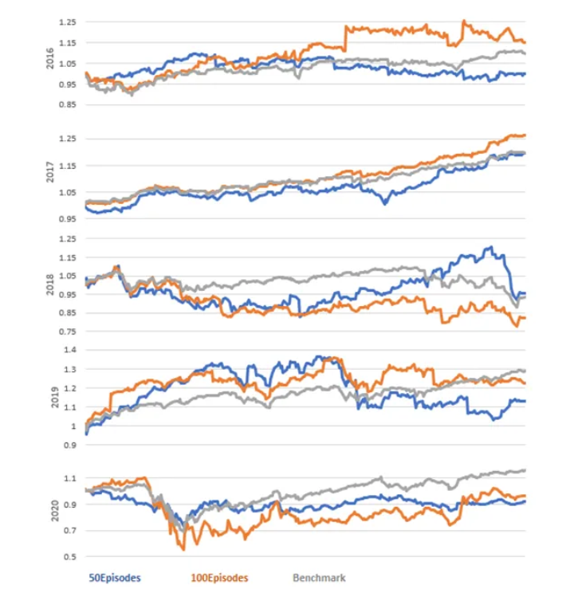
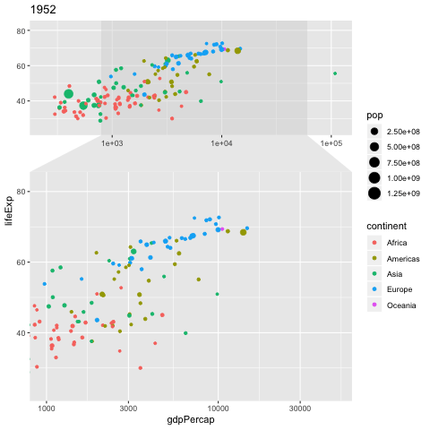

# Portfolio
---
## M2 ISDS - ISUP 

Complete projects for the  [***M2 ISDS: Ingénieur Statistique et Data Science***](https://isup.sorbonne universite.fr/formations/filiere-ingenierie-statistique-et-data-science-isds) at Sorbonne University (2022-2023).

---
### Machine Learning: Diabetes classification

In this exciting project, we embark on a journey through the intricacies of diabetes classification using Machine Learning. We kick-off by delving into a detailed exploration of the project framework, the nature of the data at our disposal, and the variables that make up our database.

Our examination is accompanied by an in-depth data visualization and a study of their correlation. The goal is to unravel the subtle links between variables, understand their interactions, and identify potential patterns.

Next, we venture into the realm of unsupervised learning, using a K-means type clustering approach. Our aim will be to determine whether we can distinguish distinct groups within our data, thereby offering new perspectives for our analysis.

Finally, we dive into the heart of the matter, the training of various classifiers. We will compare and evaluate a variety of algorithms, including Decision Tree, Logistic Regression, Random Forest, MLP, SVM, QDA, LightGBM, Gradient Boosting, and Neural Network. Our ultimate goal is to select the best-performing model for our problem while learning and discovering along the way.

 

 

---
### Time series: Wikipedia Traffic Forecast

In this riveting project, we delve deep into the realms of user interaction and server performance optimization by predicting Wikipedia page traffic. Understanding this traffic not only provides insights into user behaviour on the platform but also aids in enhancing the performance and availability of Wikipedia's servers, making this task an invaluable one.

Our aim is to accurately predict Wikipedia page traffic using a trio of diverse machine learning models. Each model adds a unique dimension to our predictive abilities:

The ARIMA model, with its emphasis on autocorrelation, allows us to harness the power of time-series data for more accurate predictions.
XGBoost, a decision-tree-based ensemble Machine Learning algorithm, aids us in capturing complex non-linear relationships within the data.
Finally, the Random Forest algorithm, with its multitude of decision trees, offers an additional layer of predictive precision.

This project offers a deep dive into these machine learning models, demonstrating their unique strengths and how their combined use can improve the precision of our traffic predictions.

 

 

---
### Industrial statistics

In this engaging project, we navigate the intersections of industrial statistics, environmental science, and economics to address a real-world challenge. The study focuses on flood management, specifically the determination of optimal embankment heights to minimize potential risks.

Our data originates from real-life scenarios, harnessing research on floods, water flow, and economic models. The objective is to calculate the most suitable embankment height, balancing the need for flood protection and economic feasibility.

We approach the problem from three distinct research directions, each providing a unique lens to interpret the data and inform the solution:

Historical Measurement-Based Approach: This approach utilizes historical measurement records to determine the embankment height, capitalizing on past data to inform future flood management strategies.

Hydraulic Model-Based Approach: This approach uses hydraulic models to forecast water flow patterns and flood likelihood, facilitating the identification of the optimal embankment height from an engineering perspective.

Economic Model-Based Approach: In this approach, we integrate economic models to analyze the costs associated with different embankment heights, aligning flood protection measures with economic realities.

By traversing these three research paths, we aim to converge on a solution that considers multiple factors, thus ensuring a robust and comprehensive resolution to the challenge at hand.

 

 

---
### Parallel Computing: Parallel Implementation of Conway's Game of Life

John Conway came up with the Game of Life in 1970. The game demonstrates the fact that some simple local rules can lead to interesting large-scale life behavior(birth, reproduction and death). The game is played in a 2 dimensional grid N x N, made of cells, that can be either alive, or dead. The game does not have any players, thus it does not require any input by the user. Each cell has at most 8 neighbours, that determine its state in the next generation. The re-formation of the grid from generation to generation is done simultaneously, meaning that each state in the next generation depends exclusively in the state of the cell and its neighbours. Our goal is to implement this game, using Parallel programming.

 

 

---
### Statistical Quality Control

In this project, we delve into the world of manufacturing with a focus on improving process efficiency through statistical quality control. The objective is to employ robust statistical methods and adequacy tests, thus ensuring processes are streamlined, waste is minimized, and a higher proportion of specification-conforming products are produced.

Our approach involves the construction and utilization of control charts, including the CUSUM (Cumulative Sum Control Chart) and EWMA (Exponentially Weighted Moving Average). These powerful statistical tools allow us to precisely detect moments of rupture in the process and accurately identify false alarm rates.

The CUSUM chart is particularly effective at identifying small shifts from the process target over time, while the EWMA chart is adept at detecting larger, sudden shifts. Together, they provide a comprehensive toolset for monitoring process variability and maintaining control.

The results from this project not only optimize the manufacturing process but also contribute to an overall reduction in waste. The insights and techniques gleaned from this work prove invaluable in promoting more efficient, sustainable, and profitable manufacturing practices.

 

 

---

### Latent structure models

#### Kmeans and Hierarchical Ascending Classification

Objective of this project is to warn against an overly systematic or blind application of PCA in a clustering study, and to explore and compare the behavior of Kmeans and ascending hierarchical clustering.

 

 

---

#### Mixing models, Model-Based Clustering, EM algorithm

Objective of this project is first to explore the behavior of the EM in the context of a simple Gaussian mixture model at J components in dimension 1
  
$$
  M = \{ \sum_{j=1}^J \pi_j \phi(\cdot; \mu_j, \sigma_j^2) : (\pi_1, \ldots, \pi_J) \in \Pi_J, \mu_1, \ldots, \mu_J \in \mathbb{R}, \sigma_1^2, \ldots, \sigma_J^2 \in \mathbb{R}_{+}^{*} \}
$$
  
  
$$
  \text{and } \Pi_J = \{(\pi_1, \ldots, \pi_J) \in [0, 1]^J : \sum_{j=1}^J \pi_j = 1\} \text{ and } \phi(\cdot; \mu, \sigma^2) \text{ the Gaussian density of expectancy } \mu \text{ and variance } \sigma^2
$$
  
It is then to initiate the model-based clustering in higher dimension with the Rmixmod package, which allows to fit mixing models.

 

 

--- 

#### Bayesian methods, Markov Chain Monte Carlo(MCMC)

This project is an introduction to Bayesian methods in the context of Gaussian mixture models models, and in particular to the Gibbs sampler and the Metropolis-Hastings algorithm. We are interested in the following mixture model:

$$
  M = \{ \pi \phi(\cdot; \mu_1, 1) + (1 - \pi) \phi(\cdot; \mu_2, 1) : \mu_1 \in \mathbb{R}, \mu_2 \in \mathbb{R} \},
$$
  
with $\phi$ being the Gaussian density on $\mathbb{R}$ and $\pi \neq \frac{1}{2}$ known.
  
The prior distribution of $(\mu_1, \mu_2)$ is given by: $\mu_1 \sim \mathcal{N}(\delta_1, \frac{1}{\lambda}), \mu_2 \sim \mathcal{N}(\delta_2, \frac{1}{\lambda}), \delta_1, \delta_2 \in \mathbb{R}$ and $\lambda > 0$, with $\mu_1$ and $\mu_2$ independent.

 

 

---
## M1 ISIFAR: Statistical and Computer Engineering for Finance, Insurance, and Risk

Complete projects for the [***M1 ISIFAR: Statistical and Computer Engineering for Finance, Insurance, and Risk***](https://master.math.univ-paris-diderot.fr/annee/m1-isifar/)) at Université de Paris (2021-2022).

---

### Asset Allocation and Portfolio Optimisation

In this project, we grapple with a classic challenge in finance: determining an investment strategy that yields optimal performance over a specified time horizon, given a set of traded assets. Our exploration takes us into the core aspects of discrete-time portfolio optimization, where the balance between risk and reward comes to the fore.

We examine three of the principal criteria in portfolio optimization to provide a comprehensive view of the problem at hand. Our methodology revolves around two potent solution strategies:

Dynamic Programming Method: A versatile approach that breaks down the larger problem into smaller, manageable sub-problems, thereby simplifying complex optimization tasks.
Martingale Method: A powerful probabilistic technique, valuable in the context of investment strategies and financial forecasting.
Further enhancing our exploration, we dive into the practicalities by providing explicit examples for both the logarithmic utility function, which captures the investor's level of risk tolerance, and the full binomial case, a method used to model the dynamics of an asset's price over time.

By undertaking this project, we aim to offer profound insights into the world of finance, contributing to more efficient, optimized investment strategies and improved financial outcomes.

 

 

---
### SVD Analysis & Life Tables

In this captivating project, we embark on an exploration of demographic data and its intricate patterns using an array of powerful techniques. Our collaboration spans various data structures, including data.frames, tibbles, and data.tables, where we leverage the capabilities of dplyr and other query languages, such as data.table, to process and manipulate the data effectively.

With the invaluable data provided by the esteemed Human Mortality Database organization (https://www.mortality.org), we dive into a world of demographic insights. Our focus is on visualizing and analyzing multivariate datasets, with a special emphasis on life tables as an essential component of demographic research.

To unravel the underlying trends and uncover hidden patterns, we employ a range of powerful techniques, including Singular Value Decomposition (SVD) analysis and Principal Component Analysis (PCA). These matrix-oriented methods provide a comprehensive understanding of the interrelationships and variations within the data.

Moreover, we delve into the application of the renowned Lee-Carter model, a widely accepted methodology for predicting mortality quotients. This model not only aids in forecasting future mortality trends but also plays a crucial role in informing public health policies and insurance industry practices.

By combining statistical analysis, data manipulation, and advanced modeling techniques, this project offers profound insights into demographic dynamics, contributing to our understanding of population trends, mortality patterns, and the intricate interplay between various demographic factors.

 

 

---

© 2023 Ngo Khoa Anh. Powered by Jekyll and the Minimal Theme.

